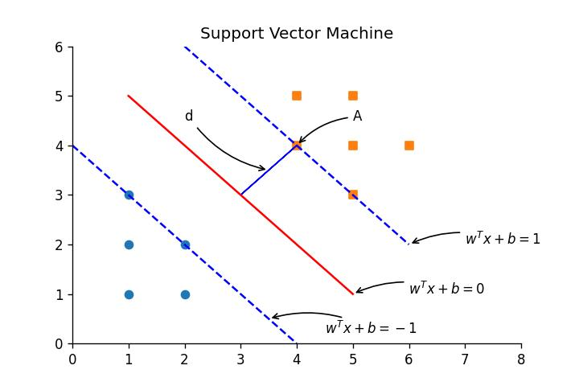

# SVM数学推导
## SVM基本数学推导

线性支持向量机通过最大化间隔来获得更好的用于分类的决策边界：
其目标函数要求使得间隔距离$d$最大，即离分割线最近的点到分割线的距离最大，而约束条件为分割线两侧的点需分属同一类别,写成数学表达式即：
$$
max \quad d 
$$
$$ s.t.\left\{
\begin{aligned}
\omega^T \cdot x_i + b & \gt 0,\quad y_i \gt 0 \\
\omega^T \cdot x_i + b& \lt 0,\quad y_i \lt 0 \\
\end{aligned}
\right.
$$

观察约束条件的形式，可以将其进一步简化为：
$$
y_i\cdot (\omega^T\cdot x_i + b) \gt 0
$$

考虑到二维空间中点(x,y)到直线Ax+By+C=0的距离为：$d = \frac{\vert Ax+By+C \vert}{\sqrt{A^2 + B^2}}$，而三维空间中点(x,y,z)到平面Ax+By+Cz+D=0的距离为$d = \frac{\vert Ax+By+Cz+D\vert}{\sqrt{A^2 + B^2 + C^2}}$。
将其拓展到超平面中，考虑到划分超平面的线性方程为：
$$
\omega^T\cdot X + b = 0
$$
其中$\omega = (w_1;w_2;w_3;···;w_d)$为法向量，决定超平面的方向，b为位移项，决定超平面和原点之间的距离，于是空间内一点到超平面的距离可描述为：
$$
d = \frac{\vert \omega^T\cdot X + b \vert}{\|\omega\|}
$$
其中$\|\omega\|=\sqrt{\omega_1^2+\omega_2^2+···\omega_n^2}$

针对某一个样本所得的函数间隔为$\vert \omega^T\cdot x + b \vert$，而对全局样本而言，函数间隔应为：
$$
min\quad \vert \omega^T\cdot x_i + b\vert ,\quad i = 1,2,···,m
$$

于是可以确定一个分类器，对任意的实数，有：
$$
\omega^T\cdot x + b \gt 1, \quad y_i = 1;
$$
$$
\omega^T\cdot x + b \lt 1, \quad y_i = -1
$$
确定上述分类器之后，此时的目标即为找到距离超平面最近的数据点，然后让其距离超平面最远，求得该情况下对应的$\omega, b$,这样原目标函数就可进一步改写为：
$$
\underset{\omega, b}{argmax} \quad \underset{i}{min} \left[y_i\cdot(\omega^T\cdot x_i + b)\cdot \frac{1}{\|\omega\|}\right]
$$
显然地，
$$
y_i \cdot(\omega^T\cdot x_i + b) \geqslant 1, \quad i=1,2,···，m
$$
即上式最小值为1，因此若要最大化间隔只需最大化$\frac{1}{\|\omega\|}$即可，也即$\|\omega\|^2$，因$\|\omega\|$描述的是向量的长度，是非负的，因此$\|\omega\|^2$达到最小时，$\|\omega\|$也达到最小，因后续过程中涉及到求导运算，故将目标函数写为：
$$
\underset{\omega, b}{min} \quad \frac{1}{2} \|\omega\|^2
$$
而上述分类器中选最小间隔为1而不是0是因为在归一化后最小间隔1对$\omega,b$的影响是一样的，但如果直接求解上述最小值问题，则显然$\|\omega\|=0$时达到目标函数的最小值，由于$margin = \frac{2}{\|\omega\|}$，在上述取最小值条件下将会导致两条分割线的距离无穷远，因此选取最小间隔为1，并得到如下带约束的最小值问题：
$$
\underset{\omega, b}{min} \quad \frac{1}{2} \|\omega\|^2
$$
$$
s.t. \quad y_i\cdot (\omega^T\cdot x_i + b) \geqslant 1,\quad i=1,2,···,m
$$

对于上述式子的求解，考虑采用拉格朗日乘子法转化对偶问题进行求解，先将约束条件改写为：
$$
h_i(\omega) = -y_i(\omega^T\cdot x_i+b)+1 \leqslant 0
$$
随后对每条约束式添加拉格朗日乘子$\alpha_i \geqslant 0$，则该问题对应的拉格朗日函数可以写为：
$$
L(\omega, b, \alpha)=\frac{1}{2}\|\omega\|^2+\sum_{i=1}^{m}\alpha_i(1-y_i(\omega^Tx_i+b))
$$

其中$\bf{\alpha}=(\alpha_1;\alpha_2;···;\alpha_m)$

分别对$\omega,b$求偏导可得：
$$
\nabla_{\omega}L(\omega,b,\alpha)=\omega-\sum_{i=1}^{m}\alpha_i y_i x_i = 0
$$
即：
$$
\omega = \sum_{i=1}^{m}\alpha_i y_i x_i
$$
以及：
$$
\frac{\partial}{\partial b}L(\omega,b,\alpha)=\sum_{i=1}^{m}\alpha_i y_i = 0
$$
将上述两式代入拉格朗日函数中化简，具体过程如下：
$$
L(\omega,b,\alpha)=\frac{1}{2}\|\omega\|^2+\sum_{i=1}^{m}\alpha_i(1-y_i(\omega^Tx_i+b))\\
=\frac{1}{2}\omega^T\omega-\sum_{i=1}^{m}\alpha_iy_i\omega^Tx_i-\sum_{i=1}^{m}\alpha_iy_ib+\sum_{i=1}^{m}\alpha_i\\
\stackrel{\omega=\sum_{i=1}^{m}\alpha_i y_i x_i}{=}\frac{1}{2}\omega^T\sum_{i=1}^{m}\alpha_i y_i x_i -\sum_{i=1}^{m}\alpha_iy_i\omega^Tx_i-\sum_{i=1}^{m}\alpha_iy_ib+\sum_{i=1}^{m}\alpha_i\\
=\frac{1}{2}\omega^T\sum_{i=1}^{m}\alpha_i y_i x_i -\omega^T\sum_{i=1}^{m}\alpha_iy_i x_i-\sum_{i=1}^{m}\alpha_iy_ib+\sum_{i=1}^{m}\alpha_i\\
=-\frac{1}{2}\omega^T\sum_{i=1}^{m}\alpha_iy_i x_i-b\sum_{i=1}^{m}\alpha_iy_i+\sum_{i=1}^{m}\alpha_i\\
\stackrel{\omega=\sum_{i=1}^{m}\alpha_i y_i x_i}{=}-\frac{1}{2}\left(\sum_{i=1}^{m}\alpha_i y_i x_i\right)^T\sum_{i=1}^{m}\alpha_iy_i x_i-b\sum_{i=1}^{m}\alpha_iy_i+\sum_{i=1}^{m}\alpha_i\\
=-\frac{1}{2}\sum_{i=1}^{m}\alpha_i y_i (x_i)^T\sum_{i=1}^{m}\alpha_iy_i x_i-b\sum_{i=1}^{m}\alpha_iy_i+\sum_{i=1}^{m}\alpha_i\\
=\sum_{i=1}^{m}\alpha_i-\frac{1}{2}\sum_{i=1,j=1}^{m}y_iy_j \alpha_i \alpha_j(x_i)^T x_j-b\sum_{i=1}^{m}\alpha_iy_i \\
\stackrel{\sum_{i=1}^{m}\alpha_i y_i = 0}{=}\sum_{i=1}^{m}\alpha_i-\frac{1}{2}\sum_{i=1,j=1}^{m}y_iy_j \alpha_i \alpha_j(x_i)^T x_j\\
=\sum_{i=1}^{m}\alpha_i-\frac{1}{2}\sum_{i=1,j=1}^{m}y_iy_j \alpha_i \alpha_j \langle \vec{x_i},\vec{x_j} \rangle
$$
这样即可转化为对偶问题：
$$
\underset{\alpha}{max}\quad \sum_{i=1}^{m}\alpha_i-\frac{1}{2}\sum_{i=1,j=1}^{m}y_iy_j \alpha_i \alpha_j \langle \vec{x_i},\vec{x_j} \rangle\\
s.t. \left\{
\begin{aligned}
& \alpha_i \geqslant 0,\quad i=1,2,···,m\\
& \sum_{i=1}^{m}\alpha_i y_i = 0\\
\end{aligned}
\right.
$$

由于此过程中有约束条件，故须满足KKT条件，即：
$$
\left\{
\begin{aligned}
& \alpha_i \geqslant 0\\
& y_if(x_i)-1 \geqslant 0 \\
& \alpha_i(y_if(x_i)-1) = 0 \\
\end{aligned}
\right.
$$

如上图所示，KKT条件反映为对于任意训练样本$(x_i,y_i)$，总有$\alpha_i=0$或$y_if(x_i)=1$成立。具体而言，当$\alpha_i=0$时，即这一类点不在分割线上，$(h_i(\omega) = -y_i(\omega^T\cdot x_i+b)+1 \lt 0)$，极值必然不会在这些点上取得，也不会在所确定的拉格朗日函数式中出现，也就不会对$f(x)$产生任何影响；当$\alpha_i \gt 0$时，此时必然有$y_if(x_i)=1$，也即$(h_i(\omega) = 0)$，所对应的样本就在最大间隔边界上，是一个支持向量(注意每一个约束式其实就是一个训练样本)。

对于上述二次规划问题，采用SMO算法进行求解，具体步骤如下：

1、先固定$\alpha_i$之外的所有参数，然后求$\alpha_i$上的极值；

2、由于存在约束条件$\sum_{i=1}^{m}\alpha_iy_i=0$，若固定$\alpha_i$之外的其他变量，则$\alpha_i$可由其它变量导出，于是SMO每次选择两个变量$\alpha_i,\alpha_j$并固定其它参数；

3、在参数初始化后，SMO不断执行以下两个操作：

(1)选取一对需更新的变量$\alpha_i,\alpha_j$；

(2)固定$\alpha_i,\alpha_j$以外的参数，求解二次规划式得到更新后的$\alpha_i$和$\alpha_j$。

注意到只要$\alpha_i,\alpha_j$中有一个不满足KKT条件，目标函数就会在迭代后增大，SMO采用了一个启发式，即使选取的两变量所对应样本之间间隔最大，这样选取的两个变量有较大的差别，相比于选取相似的变量进行更新相比，这样更新所带来的优化幅度更大。

在固定其他参数后，在仅考虑$\alpha_i$和$\alpha_j$时，约束式可改写为：
$$
\alpha_iy_i+\alpha_jy_j = \zeta, \quad \alpha_i \geq 0, \quad \alpha_j \geq 0
$$
其中：
$$
\zeta = - \sum_{k\not=i,j}\alpha_ky_k
$$
是使：
$$
\sum_{i=1}^{m}\alpha_iy_i = 0
$$
$\qquad$成立的常数。

对于原二次规划式：

$$
\underset{\alpha}{max}\quad \sum_{i=1}^{m}\alpha_i-\frac{1}{2}\sum_{i=1,j=1}^{m}y_iy_j \alpha_i \alpha_j \langle \vec{x_i},\vec{x_j} \rangle\\
s.t. \left\{
\begin{aligned}
& \alpha_i \geqslant 0,\quad i=1,2,···,m\\
& \sum_{i=1}^{m}\alpha_i y_i = 0\\
\end{aligned}
\right.
$$

用$\alpha_iy_i+\alpha_jy_j = \zeta$消去上式中的变量$\alpha_j$，即可得到一个关于$\alpha_i$的单变量二次规划问题，仅有约束$\alpha_i \geqslant 0$，这样的二次规划问题具有闭式解。

对于偏移项$b$，注意到对于任意支持向量$(x_s,y_s)$都有$y_sf(x_S)=1$，即：
$$
y_s(\sum_{i\in S}\alpha_i\alpha_j\langle x_i,x_s\rangle+b)=1
$$
其中：$S=${$i|\alpha_i \gt 0, i=1,2···,m$}为所有支持向量的下标集，这里选用所有支持向量求解的平均值获得$b$:
$$
b = \frac{1}{\vert S \vert}\sum_{s\in S}(\frac{1}{y_s}-\sum_{i\in S}\alpha_iy_i\langle x_i,x_s\rangle)
$$

## 核函数

对于在原始样本空间中不存在能够正确划分两类样本的超平面的情况，考虑将样本从原始空间映射到一个更高维的特征空间，使得样本在这个特征空间内线性可分。

令$\phi(x)$表示将$x$映射后的特征向量，那么在特征空间中划分超平面所对应的模型可表示为：
$$
f(x) = \omega^T\phi(x)+b
$$
其中$\omega,b$是模型的参数，类似上述推导，应有：
$$
\underset{\omega,b}{min} \frac{1}{2} \parallel\omega\parallel^2\\
s.t.\quad y_i(\omega^T\phi(x_i)+b)\geqslant 1, i=1,2,···,m
$$
同理可由对偶问题处理为：
$$
\underset{\alpha}{max} \sum_{i=1}^{m}\alpha_i-\frac{1}{2}\sum_{i=1}^{m}\sum_{j=1}^{m}\alpha_i\alpha_jy_iy_j \langle \phi(x_i), \phi(x_j)\rangle\\
s.t.\quad \sum_{i=1}^{m}\alpha_iy_i=0,\\
\alpha_i \geqslant 0, i=1,2,···,m
$$
由于求解上述规划问题需要求解$\langle\phi(x_i),\phi(x_j)\rangle$，即样本$x_i$与$x_j$映射到高维特征空间之后的内积，由于其维数可能很高，将使得计算难以进行，因此令:
$$
\kappa(x_i,x_j)=\langle\phi(x_i),\phi(x_j)\rangle=\phi(x_i)^T\phi(x_j)
$$
从而原规划问题可改写为：
$$
\underset{\alpha}{max} \sum_{i=1}^{m}\alpha_i-\frac{1}{2}\sum_{i=1}^{m}\sum_{j=1}^{m}\alpha_i\alpha_jy_iy_j\kappa(x_i,x_j)\\
s.t.\quad \sum_{i=1}^{m}\alpha_iy_i=0,\\
\alpha_i \geqslant 0, i=1,2,···,m
$$
对其进行求解即可得到：
$$
f(x)=\omega^T\phi(x)+b\\
=\sum_{i=1}^{m}\alpha_iy_i\phi(x_i)^T\phi(x)+b\\
=\sum_{i=1}^{m}\alpha_iy_i\kappa(x,x_i)+b
$$
该式显示出模型的最优解可以通过训练样本的核函数展开，这一展式也被称为“支持向量展式”。

对于合适的核函数的存在性以及核函数的选取，可利用如下定理：
#### 定理：（核函数）
令$\chi$为输入空间，$\kappa(·,·)$是定义在$\chi \times \chi$上的对称函数，则$\kappa$是核函数当且仅当对于任意数据$D=$ {$x_1,x_2,···,x_m$}，“核矩阵” $\textbf{K}$总是半正定的：
$$
\textbf{K}=\begin{bmatrix}
\kappa(x_1,x_1) &\cdots &\kappa(x_1,x_j) &\cdots & \kappa(x_1,x_m)\\
\vdots & \ddots &  \vdots & \ddots & \vdots \\
\kappa(x_i,x_1) & \cdots & \kappa(x_i,x_j) & \cdots &\kappa(x_i,x_m)\\
\vdots & \ddots &  \vdots & \ddots & \vdots \\
\kappa(x_m,x_1) &\cdots & \kappa(x_m,x_j) & \cdots & \kappa(x_m,x_m)
\end{bmatrix}
$$
该定理表明，只要一个对称函数所对应的核矩阵半正定，它就能作为核函数使用，事实上，对于一个半正定核矩阵，总能找到一个与之对应的映射$\phi$。

<!-- 让表格居中显示的风格 -->

表1 常用核函数

| 名称  | 表达式  |   参数   |
| :---: | :---: | :------: |
|   线性核   |$\kappa(x_i,x_j)=x_i^Tx_j$|  |
|   多项式核   |$\kappa(x_i,x_j)=(x_i^Tx_j)^d$|$d\geqslant1$,为多项式的系数|
|   高斯核   |$\kappa(x_i,x_j)=exp(-\frac{\parallel x_i-x_j\parallel^2}{2\sigma^2})$|$\sigma \geqslant 0为高斯核的带宽$|
|   拉普拉斯核   |$\kappa(x_i,x_j)=exp(-\frac{\parallel x_i-x_j\parallel}{\sigma})$|$\sigma \gt 0$|
|   Sigmoid核   |$\kappa(x_i,x_j)=tanh(\beta x_i^Tx_j+\theta)$|$tanh$为双曲正切函数,$\beta \gt 0, \theta \lt 0$|

此外，还可通过函数组合得到：

① 若$\kappa_1$和$\kappa_2$为核函数，则对于任意整数$\gamma_1$与$\gamma_2$，其线性组合$\gamma_1\kappa_1 + \gamma_2\kappa_2$也为核函数。

②若$\kappa_1$和$\kappa_2$为核函数，则核函数的直积：
$$
\kappa_1\otimes\kappa_2(x,z)=\kappa_1(x,z)\kappa_2(x,z)
$$
$\qquad$也是核函数。

③若$\kappa_1$为核函数，则对于任意函数$g(x)$，
$$
\kappa(x,z)=g(x)\kappa_1(x,z)g(z)
$$
$\qquad$也是核函数。

## 软间隔及正则化
上述过程中对样本数据的划分为硬间隔划分，即要求所有样本均满足约束，所有样本都必须划分正确。为缓解过拟合，我们允许支持向量机在一些样本中出错，因此引入“软间隔”的概念，允许某些样本不满足约束：
$$
y_i(\omega^Tx_i+b)\geqslant 1
$$
但在最大化间隔的同时，应要求不满足约束的样本尽可能少，优化目标改写为：
$$
\underset{\omega,b}{min}\quad \frac{1}{2}\parallel\omega \parallel^2 + C\sum_{i=1}^{m}l_{0/1}(y_i(\omega^Tx_i+b)-1)
$$
其中$C\gt0$是一个常数，$l_{0/1}$是“0/1损失函数”：
$$
l_{0/1}=\left\{
\begin{aligned}
&1, &z\lt0\\
&0, &否则  
\end{aligned}
\right.  
$$
显然，当$C$趋近无穷时，上规划式迫使所有样本均满足约束，与原推导等价，而当$C$取有限值时，上式允许一些样本不满足约束。

但$l_{0/1}$是非凸、非连续函数，数学性质不好，因此采用一些其他函数来替代它：

hinge loss(合页损失)：
$$
l_{hinge}(z)=max(0,1-z)
$$

exponential loss(指数损失)：
$$
l_{exp}(z)=exp(-z)
$$

logistic loss(对率损失):
$$
l_{log}(z)=log(z+exp(-z))
$$

考虑采取合页损失，则原目标函数变为：
$$
\underset{\omega,b}{min}\quad \frac{1}{2}\parallel\omega \parallel^2 + C\sum_{i=1}^{m}max(0,1-y_i(\omega^Tx_i+b))
$$

再引入“松弛变量”$\xi_i\geqslant0$，可将上式重写为：
$$
\underset{\omega,b}{min}\quad \frac{1}{2}\parallel\omega \parallel^2 + C\sum_{i=1}^{m}\xi_i\\
s.t.\quad y_i(\omega^Tx_i+b)\geqslant 1-\xi_i\\
\xi_i\geqslant0,i=1,2,···,m
$$

显然，对于上式中，每一个样本都有一个对应的松弛变量，用以表征该样本不满足约束的程度，这仍是一个二次规划问题，可通过拉格朗日乘子法得到下面的拉格朗日函数：
$$
L(\omega,b,\alpha,\xi,\mu)=\frac{1}{2}\parallel\omega \parallel^2 + C\sum_{i=1}^{m}\xi_i+\sum_{i=1}^{m}\alpha_i(1-\xi_i-y_i(\omega^Tx_i+b))-\sum_{i=1}^{m}\mu_i\xi_i
$$
其中，$\alpha_i\geqslant0,\mu_i\geqslant0$就是拉格朗日乘子，令$L(\omega,b,\alpha,\xi,\mu)$对$\omega,b,\alpha,\xi,\mu$的偏导分别为0可得：
$$
\omega=\sum_{i=1}^{m}\alpha_iy_ix_i\\
\sum_{i=1}^{m}\alpha_iy_i=0\\
C=\alpha_i+\mu_i
$$
同理，按照原推导将上述三个式子带入规划问题中，可得对偶问题：
$$
\underset{\alpha}{max}\quad \sum_{i=1}^{m}\alpha_i-\frac{1}{2}\sum_{i=1}^{m}\sum_{j=1}^{m}\alpha_i\alpha_jy_iy_j\langle x_ix_j\rangle\\
s.t.\quad \sum_{i=1}^{m}\alpha_iy_i=0,\\
0\leqslant\alpha_i\leqslant C,i=1,2,···,m
$$
可采用与硬间隔同样的算法求解上述问题，且在引入核函数后能得到同样的支持向量展式。

对软间隔支持向量机，同样有KKT条件约束：
$$
\left\{
\begin{aligned}
&\alpha_i\geqslant0, \qquad \mu_i\geqslant0\\
&y_if(x_i)-1+\xi_i\geqslant 0,\\
&\alpha_i(y_if(x_i)-1+\xi_i)=0,\\
&\xi_i\geqslant0,\qquad \mu_i\xi_i=0
\end{aligned}
\right.  
$$
这样，对于任意训练样本$(x_i,y_i)$，总有$\alpha_i=0$或$y_if(x_i)=1-\xi_i$：若$\alpha_i=0$，则该样本非极值，不会对$f(x)$有任何影响；若$\alpha_i\geqslant0$，则必有$y_if(x_i)=1-\xi_i$，即该样本为支持向量。

又由对拉格朗日函数求偏导为0所得条件式：
$$
\omega=\sum_{i=1}^{m}\alpha_iy_ix_i\\
\sum_{i=1}^{m}\alpha_iy_i=0\\
C=\alpha_i+\mu_i
$$
知：

若$\alpha\lt C$，则$\mu_i\gt 0$，进而有$\xi_i=0$，即该样本恰在最大间隔边界上；若$\alpha=C$，则有$\mu_i=0$，此时若$\xi_i\leqslant 1$则该样本落在最大间隔内部，若$\xi_i\gt 1$则该样本被错误分类。由此可见软间隔支持向量机的最终模型仅与支持向量有关，即通过采用hinge loss函数仍保持了稀疏性。

由上述，还可以用其他的替代损失函数替换式中的$l_{0/1}$损失函数，从而得到其他学习模型，这些模型的性质与所用替代函数直接相关，但在形式上都具有共性：
优化目标中的第一项用以刻画划分超平面的“间隔”大小，另一项$\sum_{i=1}^{m}l(f(x_i),y_i)$用来表述训练集上的误差，可进一步写为更一般的形式：
$$
\underset{f}{min}\quad \Omega(f)+C\sum_{i=1}^{m}l(f(x_i),y_i)
$$
其中$\Omega(f)$被称为“结构风险”，用于描述模型$f$的某些性质，第二项$\sum_{i=1}^{m}l(f(x_i),y_i)$称为“经验风险”，用于描述模型与新联数据的契合程度。上式也称为“正则化问题”，$\Omega(f)$即为正则化项，$C$即为正则化系数($L_p$范数是常用的正则化项)。